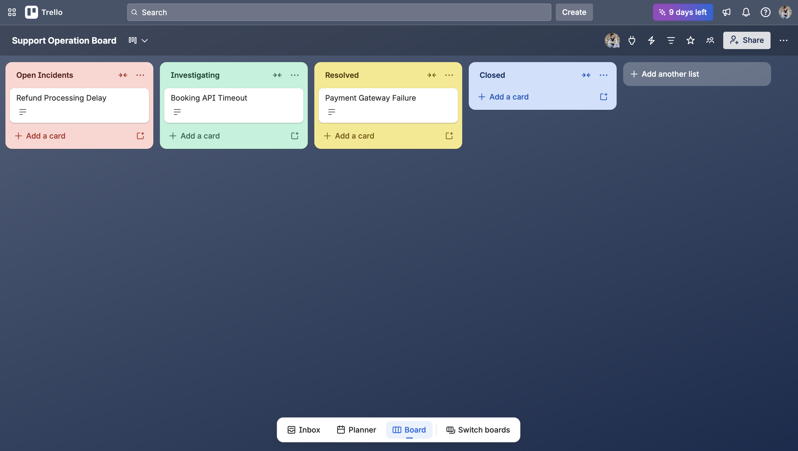
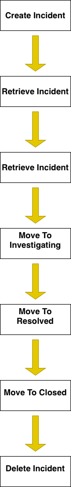
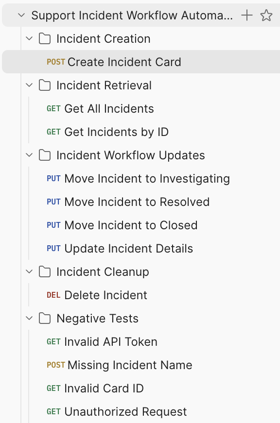
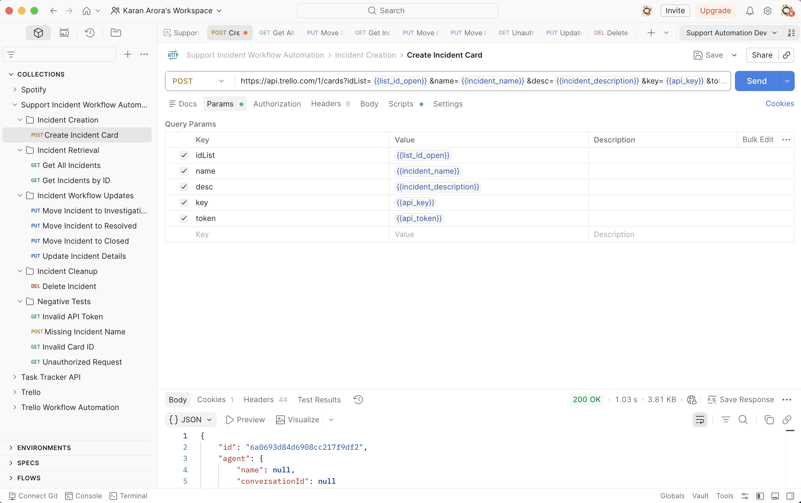
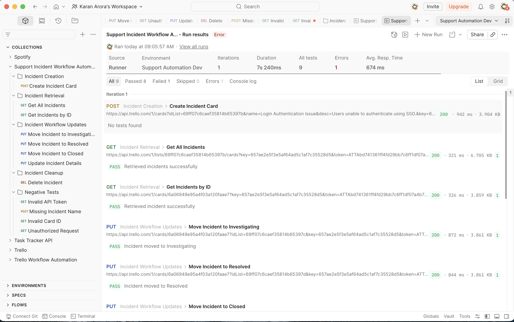

# Trello Incident Workflow API Automation

## Workflow Board

## Project Overview
This project simulates a real-world incident management workflow using the Trello REST API and Postman automation.

The workflow models operational incident lifecycle stages commonly used in SaaS support and technical operations environments:

Open Incidents → Investigating → Resolved → Closed

The project demonstrates API testing, workflow automation, request chaining, dynamic variables, negative testing, and CRUD operations.

---

## Workflow Architecture

  

___

## Features

- Dynamic incident generation
- Automated card ID capture
- Incident lifecycle workflow automation
- CRUD API operations
- Collection Runner automation
- Negative API testing
- Reusable environment variables
- Request chaining using Postman scripts

---

## Tech Stack

- Postman
- Trello REST API
- JavaScript (Postman Scripts)
- GitHub
- Draw.io
---

## API Operations Covered

### Incident Creation
- Create Incident

### Incident Retrieval
- Get All Open Incidents
- Get Incident By ID

### Incident Workflow Updates
- Move Incident To Investigating
- Move Incident To Resolved
- Move Incident To Closed
- Update Incident Details

### Incident Cleanup
- Delete Incident

### Negative Testing
- Invalid API Token
- Invalid Card ID
- Create Incident Without Name

---

## Automation Features

- Dynamic incident generation using Pre-request Scripts
- Automatic card ID storage using Post-response Scripts
- Environment variable management
- Collection Runner workflow execution

---

## Postman Collection Structure

The Postman collection is organized into workflow-based folders covering CRUD operations, workflow transitions, and negative testing.

Collection Structure

---

## Create Incident Automation

Demonstrates dynamic incident generation, parameterized requests, and automatic card ID capture using Post-response scripts.

Create Incident

---

## Collection Runner Execution

Shows end-to-end automation of the incident lifecycle workflow using Collection Runner.

Collection Runner

---

## How To Run

1. Import Postman collection
2. Import environment file
3. Add Trello API credentials
4. Run collection using Collection Runner

---

## Future Improvements

- Newman CLI integration
- HTML reporting
- GitHub Actions CI/CD pipeline
- REST Assured implementation
- Slack/Webhook integrations
